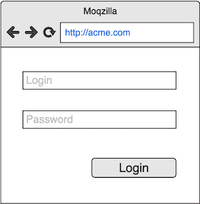

# Język Gherkin dla Product Ownerów
* __Rozwijane przez__: [Michał Bartyzel](https://www.michalbartyzel.pl/michal-bartyzel)
* __Prawa autorskie i majątkowe__: [Michał Bartyzel](https://www.michalbartyzel.pl/michal-bartyzel)
* __Wersja__: 1.0
* Możesz używać i rozpowszechniać ten dokument w dowolny sposób o ile:
    - pozostawisz go w takiej formie, w jakiej go otrzymałeś - w całości
    - zawsze dodasz ww. informacje o autorstwie i prawach

---



# Czy to zdanie ma sens?
*Zakładając ze Klient jest zalogowany oraz jest w Pulpicie, jeżeli wybrał 'Pokaż historię', wtedy widzi historię transakcji od początku bieżącego miesiąca*

Nieco inaczej ułożone jest bardzo skuteczną formą precyzowania swoich oczekiwań:

* **Zakładając** że Klient jest zalogowany
* **Oraz** jest w Pulpicie
* **Jeżeli** wybrał 'Pokaż historię'
* **Wtedy** zobaczył historię transakcji od początku ostatniego miesiąca

## Scenariusze
Użytkownik chce w systemie wykonać jakieś zadanie
np.: wykonać przelew, zobaczyć historię operacji.

**Scenariusz** ścieżka użytkownika od *jakiegoś* 
punktu początkowego do momentu zrealizowania tego zadania.

### Typy scenariuszy
* **Podstawowy** - ten, którym użytkownik, zgodnie z założeniami PO, powinien przechodzić najczęściej; np. *pomyślne zalogowanie w systemie*
* **Alternatywny** - inną ścieżką prowadzą użytkownika do efektu, np. "logowanie za pomocą Google"
* **Wyjątkowy** - wydarzyło się coś, co nie powinno i trzeba podjąć jakieś działania zaradcze; np.: "użytkownik podał błędne hasło" "brak dostępu do usługi"

[comment]: *Ćwiczenie: odkrywanie scenariuszy na stronie logowania*

## Precyzja przede wszystkim
Przykładowy scenariusz ze strony logowania:

* *klient wpisuje login* - własny login, czy numer klienta?
* *klient wpisuje hasło* - który klient: indywidualny? biznesowy? zamożny?
* *klient się loguje* - zażądał logowania? jest w trakcie logowania? właśnie się zalogował?

Ponadto:

* w którym momencie klient zaczął realizować to zadanie?
* w jakim konkretnie punkcie końcowym znalazł się po pomyślnym zalogowaniu?

## Schemat scenariusza
Scenariusz składa się z kroków. Istnieją następujące rodzaje kroków.

* ```ZAKŁADAJĄC``` - definiuje punkt początkowy; może być wiele takich kroków w scenariuszu
* ```JEŻELI``` - wskazuje na zdarzenie, które spowodował użytkownik
* ```WTEDY``` - określa, co jest rezultatem wystąpienia zdarzenia

Przykład:

```gherkin
Scenariusz: Pomyślne logowanie klienta indywidualny za pomocą numeru klienta
	Zakładając że Klient indywidualny jest na stronie głównej
	Zakładając Klient indywidualny podał numeru klienta
	Zakładając Klient indywidualny podał hasło
	Jeżeli Klient indywidualny zażądał zalogowania
	Wtedy Pojawia się widok główny 
```
[comment]:: *Ćwiczenia na pisanie scenariuszy*

## Czym jest zdarzenie?
Zdarzenie jest czym co...się wydarzyło. Jest zatem czasie przeszłym w trybie dokonanym:

* _"klient wpisał hasło"_, zamiast _"klient wpisuje hasło"_

Posługiwanie się zdarzeniami w kroku ```Jeżeli``` jest bardzo istotne, ponieważ zdarzenia reprezentują fakty, które zaistniały w systemie, na które należy zareagować.

Jeśli posługujesz się trybem ciągłym - "wpisuje hasło" - to wiadomo, że coś się zaczęło dziać, ale nie wiadomo kiedy się skończyło i czy w ogóle. W związku z tym nie wiadomo jak to zaprogramować.

## Określ właściwie zdarzenie
*	*Klient się zalogował*?
*	*Czy raczej klient zażądał zalogowania*?
*	Na pewno nie *Klient kliknął przycisk 'Zaloguj'*

## Pisz scenariusze zamiast opisywać wygląd
Tak jest źle:
```gherkin
Scenariusz: Wygenerowanie historii transakcji
	Zakładając ze Klient jest zalogowany
	Oraz jest w Pulpicie
	Jeżeli klika guzik 'Pokaż historię'
	Wtedy widzi tabelkę transakcji od początku bieżącego miesiąca
```

Tak jest dobrze:
```gherkin
Scenariusz: Wygenerowanie historii transakcji
	Zakładając ze Klient jest zalogowany
	Oraz jest w Pulpicie
	Jeżeli wybrał 'Pokaż historię'
	Wtedy widzi historię transakcji od początku bierzącego miesiąca
```

# Ścieżki krytyczne
__Ścieżka krytyczna__, to taki scenariusz, w którym błąd wymaga wdrożenia _hotfixa_.

Istnieją trzy źródła ścieżek krytycznych:

* Uwarunkowania biznesowe
	- _Czy to jest dla klienta VIP?_
	- _Czy to jest wizerunkowo bardzo istotne?_
	- _Czy to jest istotne ze względów marketingowych?_
	- _Czy intensywnie promujemy tę funkcjonalność?_
	- _Czy ta funkcjonalność związana jest istotnym przychodem?_
* Faktyczne wykorzystanie funkcjonalności
	- _Która z funkcjonalności jest najintensywniej używana_?
	- _Jakie jest zachowanie klienta podczas korzystania z danej funkcjonalności?_
* Uwarunkowania technologiczne
	- _Czy jeśli występują problemy w tej kwestii to jesteś o nich informowany/a?_

[comment]: Ćwiczenie na identyfikowanie ścieżek krytycznych

# Funkcjonalność jako grupa scenariuszy	
Jeden US/FS będzie zawierał wiele scenariuszy krytycznych, pozytywnych, alternatywnych, wyjątkowych. Umieszczaj je w:

* w Jira, w opisie danego user story
* w pliku `*.feature` załączony do danego US w Jira
	- Nazwa pliku to nr danego US np. _DROPP-123.feature_

Przykładowy plik `*.feature`;

```gherkin
Funkcjonalność: Logowanie, MENT-444

Scenariusz: Poprawne logowanie klienta indywidualnego numerem klienta
	Zakładając że...
	Jeżeli ...
	Wtedy ...

Scenariusz: Poprawne logowanie klienta indywidualnego numerem klienta
	Zakładając że...
	Jeżeli ...
	Wtedy ...
```

## Zbiorcze założenia
Staraj się myśleć o zdaniach `Zakładając, że (...)` jak o klockach, z których będziesz konstruować scenariusze dla danego US. Twórz te klocki tak, abyś mógł je używać wielokrotnie w obrębie danego US.

Jeśli zatem pewne zdanie `Zakładając, że (...)` powtarza się w każdym scenariuszu, to możesz zastosować założenia zbiorcze - `Założenia`.

```gherkin
Funkcjonalność: Generowanie historii transakcji, XYZ-123

Założenia:
	Zakładając ze Klient jest zalogowany
	Oraz jest w Pulpicie

Scenariusz: Wygenerowanie historii transakcji od początku m-ca
	Jeżeli wybrał 'Pokaż historię'
	Wtedy widzi historię transakcji od początku bieżącego miesiąca

Scenariusz: Wygenerowanie historii transakcji dla dowolnego zakresu
	Zakładając ...jakieś specyficzne założenia...
	Jeżeli ...
	Wtedy ...
```

W powyższym przykładzie kroki z części `Założenia:` dotyczą każdego ze scenariuszy w tym pliku. Poszczególne scenariusze mogą dodawać swoje specyficzne założenia.

## Szablony scenariuszy
Przypuśćmy, że stworzyłeś następujące scenariusze:

```gherkin
Scenariusz: Poprawna wysyłka SMSów do różnych krajów
	Zakładając że Operator jest zalogowany
	Zakładając że Klient ma numer telefonu +48 505 606 707
	Jeżeli Operator zadzwonił do klienta
	Wtedy z numeru 32 46 12 300 nawiązujemy połączenie z numerem +48 505 606 707
	Wtedy System zapisuje wykonane połączenie w historii kontaktów z klientami z PL

Scenariusz: Poprawna wysyłka SMSów do różnych krajów
	Zakładając że Operator jest zalogowany
	Zakładając że Klient ma numer telefonu +44 901 300 809
	Jeżeli Operator zadzwonił do klienta
	Wtedy z numeru 32 46 12 300 nawiązujemy połączenie z numerem +44 901 300 809
	Wtedy System zapisuje wykonane połączenie w historii kontaktów z klientami z UK
```

W powyższych scenariuszach schemat scenariusza jest ten sam, zmieniają się jedynie kraje, do których wykonywane jest połączenie. W takich przypadkach wygodne jest użycie szablonu scenariusza:

```gherkin
Szablon scenariusza: Poprawna wysyłka SMSów do różnych krajów
	Zakładając że Operator jest zalogowany
	Zakładając że Klient ma numer telefonu <tel_klienta>
	Jeżeli Operator dzwonił do klienta
	Wtedy z numeru 32 46 12 300 nawiązujemy połączenie z numerem <tel_klienta>
	Wtedy System zapisuje wykonane połączenie w historii kontaktów z klientami z <kraj>

	Przykłady:
	|kraj|  tel_klienta  |
	| PL |+48 505 606 707|
	| UK |+44 901 300 809|
	| LK |+94 444 2232   |
```

# Cykl rozwoju scenariuszy 
TBD

# Kto pisze scenariusze? 
* PO - definiuje funkcjonalność i scenariusz podstawowy
* Zespół - doprecyzowuje w tracie refinementu; może potrzeba więcej przykładów
* Developerzy/Testerzy - rozpisują scenariusze brzegowe, automatyzują je, konsultują z PO

# Przepis dla PO
1. Zapisz scenariusz podstawowy
2. Zapisz ścieżki krytyczne
3. Opowiedz zespołowi o wymaganiu oraz scenariuszach
4. Współpracuj z testerami, aby doprecyzować scenariusze brzegowe

# Słowa kluczowe języka Gherkin
Dla ułatwienia w skrypcie posługiwaliśmy się polską wersją języka Gherkin. Najczęściej używana jest domyślna składania anglojęzyczna. Poniższa tabelka pokazuje nazwy polskie oraz ich angielskie odpowiedniki:

| 		Po polsku 		| 	  Po angielsku	 |
|-----------------------|--------------------|
| `Założenia` 	   		| `Background` 		 |
| `Funkcjonalność` 		| `Feature`	   		 |
| `Scenariusz` 	   		| `Scenario`   		 |
| `Zakładając` 	   		| `Given`      		 |
| `Jeżeli`         		| `When`	   		 |
| `Wtedy` 		   		| `Then`       		 |
| `Oraz`           		| `And`        		 |
| `Ale`            		| `But`        		 |
| `Przykłady`   	    | `Examples` 		 |
| `Szablon scenariusza` | `Scenario Outline` |

---

# Język Gherkin dla Product Ownerów
* __Rozwijane przez__: [Michał Bartyzel](https://www.michalbartyzel.pl/michal-bartyzel)
* __Prawa autorskie i majątkowe__: [Michał Bartyzel](https://www.michalbartyzel.pl/michal-bartyzel)
* __Wersja__: 1.0
* Możesz używać i rozpowszechniać ten dokument w dowolny sposób o ile:
    - pozostawisz go w takiej formie, w jakiej go otrzymałeś - w całości
    - zawsze dodasz ww. informacje o autorstwie i prawach

