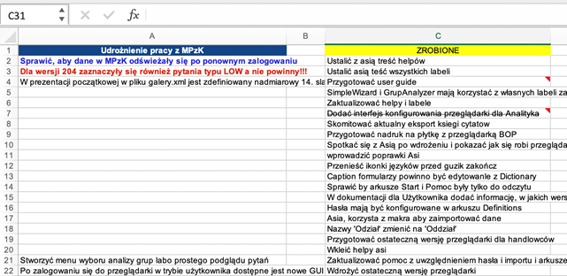
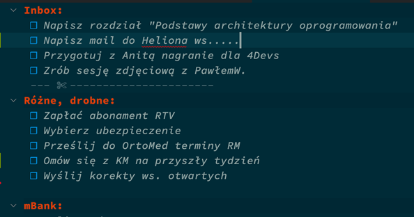
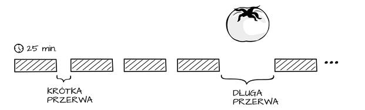

# FAQ pracy zdalnej

## Przygotowanie do pracy

Załóż strój "do pracy". Pomoże to uporządkować dzień, łatwiej skupisz się na codziennych obowiązkach.

### Przygotuj pisemną listę zadań 

Forma pisemna jest kluczowa, gdyż w trakcie czynności pisania odkryjesz rzeczy, które nie zostały jeszcze wystarczająco doprecyzowane.

### Dziel zadania na małe części

Zwróć uwagę, aby każde zadanie wydawało się możliwe do wykonania w 2h.
Mając drobne zdania na liście łatwiej radzić sobie z rozpraszaczami.
Jeśli zadanie jest zbyt duże podziel je na części
Zadania 2h zapewnią ci możliwość weryfikowania postępów pracy z dokładnością do 1/2 dnia

Przykład listy zadań w arkuszu Excel:

Przykład listy zadań w SublimeText3 + PlainTasks:

### W zadaniu ujmij oczekiwany rezultat

Zadanie może być skupione na czynności albo na rezultacie.
W tabeli znajdują się przykłady tego samego zadania sformułowanego odnośnie do czynności oraz odnośnie do rezultatu.

|   **na czynności**  |                             **na czynności**                            |
|:-------------------:|:-----------------------------------------------------------------------:|
| Przeanalizuj ofertę | Wypisz punkty z oferty o największych skutkach prawnych                 |
| Sprawdź maile       |                 Odpowiedz na maile w sprawie projektu X                 |
| Spotkaj się z Y     | W trakcie spotkania z X, ustal odpowiedzi na następujące pytania: (...) |

Preferuj zadnia skoncentrowane na rezultacie. Po prostu łatwiej i szybciej się je robi.-=]

**Ważne:** Może ci się wydawać, że rozpisywanie zadań zajmuje dużo czasu. To nieprawda. Precyzowanie tego, co masz do zrobienia zajmuje dużo czasu, gdyż wymaga zdobycia informacji i podjęcia decyzji. Samo rozpisywanie trwa bardzo krótko.

### Podobne zadania łącz w grupy

Zadania podobne do siebie np. telefony łącz w grupy i wykonuj w jednym bloku czasowym.

### Ustal cel dnia

Czyli zadanie najważniejsze na dziś i od niego zacznij pracę.
Mimo, że daną pracę najczęściej wykonuje się przez wiele dni, to jednak ludzie lepiej czują się, jak coś konkretnego zakończą danego dnia.
Wyznaczenie zadania najważniejszego sprawi, że dzień nie będzie przeciekał przez palce.

## W trakcie pracy

### Zapisz moment przerwania zadania
Jeśli musisz zrobić przerwę na sprawy domowe. Zapisz w notatniku lub na kartce moment, w którym zakończyłeś pracę i co zamierzałeś robić w kolejnym kroku. Pozwoli to łatwiej zacząć zadanie po powrocie do pracy.

### Wyznacz godziny bez spotkań

Wyznacz stałe godziny, których pracujesz nad swoim zadaniami i:
nie planuj tam żadnych spotkań
wyłącz Outlooka wraz z powiadomieniami
na Skype zmień status na niedostępny
nie odbieraj telefonów

Przykładowy harmonogram dnia:
* 8-11 - czas na pracę własną
* 11-14 - konieczne spotkania
* 14-16 - czas na pracę własną

# Wypróbuj Pomodoro Technique

Pomodoro to gra. Celem tej gry jest zdobycie jak najwięcej interwałów czasu, w których pracujesz nad wybranym zadaniem w pełnym skupieniu.

Podstawowe zasady gry:

* Pracujesz w skupieniu nad jednym zadaniem prze 25 minut,
* Po 25 minutach następuje 5 minut przerwy,
* Po każdych czterech 25-minutowych cyklach następuje 15 minut przerwy,
* W ciągu 25-minutowego czasu pracy:
* Dozwolona jest tylko praca,
* Jeśli pojawia się rozpraszacz wewnętrzny lub zewnętrzny należy zapisać to w rejestrze i wrócić do pracy,
* Jeśli po pojawieniu się rozpraszacza zrobisz coś więcej niż wyłącznie zapisanie w rejestrze to ten interwał uważa się za niezaliczony,
* Oznaczaj pojawiające się rozpraszacze wewnętrzne i zewnętrzne,
* Celem gry jest zebranie jak największej ilości 25-minutowych interwałów w ciągu dnia
* Jeśli zakończysz zadanie przed upływem interwału, nie wolno rozpocząć nowego zadania. Musisz kontynuować pracę nad bieżącym zadaniem i na przykład dopracowywać szczegóły. Celem jest tu nabycie umiejętności dzielenia pracy na 25-minutowe odcinki czasu.

**Narzędzia:**

* możesz użyć stopera z telefonu
* albo wtyczki do Google Chrome Pomello

**Podpowiedź:** Pomodoro dobrze sprawdza się podczas robienia dłuższych zadań. Przy dużej ilości drobnych zadań upakowanych w 25 minut sprawdza się nieznacznie gorzej.

## Kalendarz

### W kalendarzu rezerwuj czas na pracę

Zmień sposób używania kalendarza. Zapisuj w nim przede wszystkim bloki pracy zamiast wyłącznie spotkań:

* ZAMIAST: Status - 9-9.30
* WPISUJ: Praca nad projektem XYZ 10-11.30
* Przerwę lunchową zarezerwuj z góry jako wydarzenie cykliczne (uśmiech)

Najkorzystniej jest zysnchronizować ww. bloki pracy w zespole. Synchronizacja pomiędzy zespołami może być również przydatna.

### Dzwoń zamiast wbijać spotkanie

Nie rezerwuj z wyprzedzeniem w kalendarzu czasu na rozmowę z jedną lub dwoma osobami ponieważ:

* taka rozmowa na pa pewno potrwa 15-30 minut (domyślne wartości).
* kilka minut przed rozmową nie wykonasz niczego wartościowego, bo będziesz przygotowywać się do rozmowy
* 
Zadzwoń, napisz na chat. Jeśli rozmówca będzie niedostępny skontaktuje się później.
Oddzwaniaj.

### Odmawiaj udziału w spotkaniach bez określonego celu

Szanuj swój czas. Jeśli otrzymujesz zaproszenie na spotkanie bez określonych, rzeczy które organizator zamierza osiągnąć: odrzucaj je i zawsze podaj konkretny powód nieobecności.

Jeśli już jednak zdecydowałeś się dołączyć do spotkania, uczestnicz w nim w pełni. Odłóż telefon, zamknij outlooka. Słuchaj, i pytaj. Wnieś wkład w spotkanie.

### W zaproszeniu określaj spodziewane efekty spotkania

Efektami spotkania są:

* podjęte decyzje w temacie X
* zdobyta wiedza na temat X
* odpowiedzi na pytania X, Y, Z

Efektami spotkania NIE są:

* pogadajmy o projekcie X
* przeanalizujmy temat Y
* zsynchronizujmy się

## Spotkania online/konferencje audio
 
### Preferuj rozmowy jeden-na-jeden

Nie wszystkie tematy trzeba omawiać grupowo i demokratycznie podejmować decyzje. Omów z zespołem i managerem zakres decyzji do podejmowania w pojedynkę.
 
### Wirtualny Open-Space
Spotkanie, na które się wdzwaniasz, aby...poołpenspejsować, pogadać przy kawie, itp. Testowaliśmy 15-20 minut. Jest OK.

### Zasady dyskusji online

W trakcie dyskusji mailowych, na chacie i konferencji audio zespół może przyjąć zasady:

* Jeśli coś mówisz i nikt się nie odzywa, oznacza to, ze wszyscy się zgadzają
* Jeśli ktoś proponuje jakieś rozwiązanie i nikt nie poda alternatywy oznacza to, że rozwiązanie zostało przyjęte
* Jeśli się nie zgadzasz z czymś co zostało zaproponowane powiedz to teraz
* Jeśli się nie zgadzasz z czymś, co zostało zaproponowane, przedstaw alternatywną propozycję

