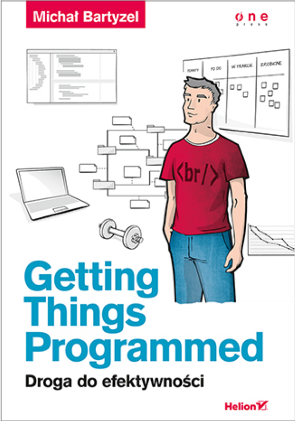
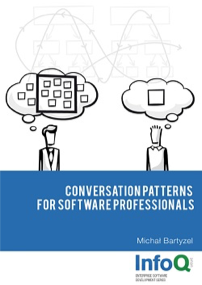

<!-- 
_backgroundColor: #bfe3b4 
_paginate: false
_footer: ""
-->
# <!--fit--> markdown is cool!

### @michalbartyzel

  

---
# rules and exceptions

* Single Resp. Principle violation might have sense

```java
void saveOrUpdate(Object o);
```

---


# more solid

* Single Responsibility
* Open-Close
* Liscov
* Interface Segregation
* Dependency Inversion
