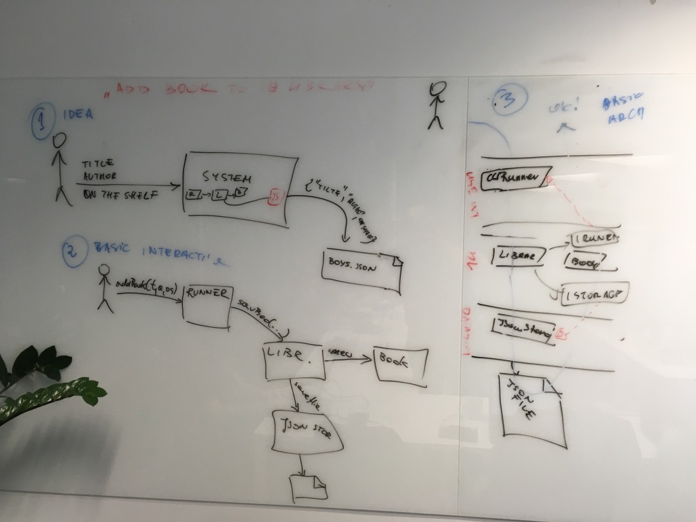
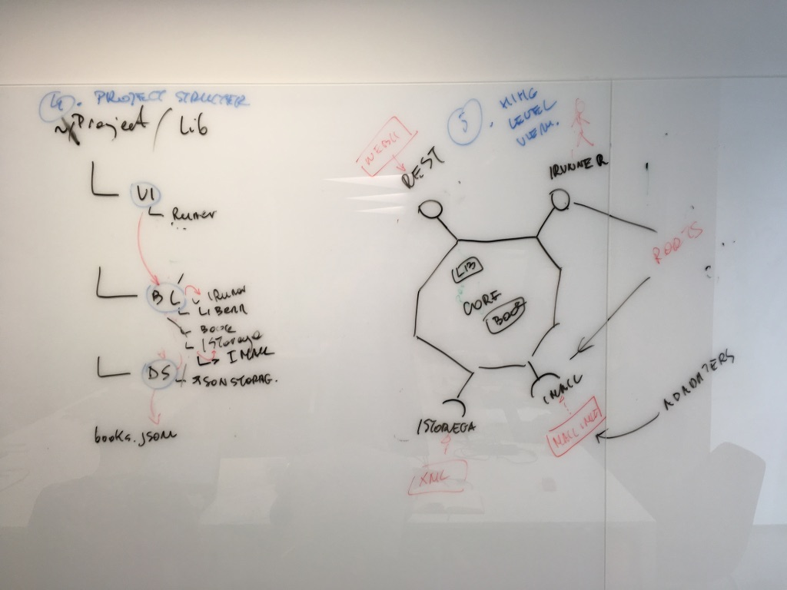
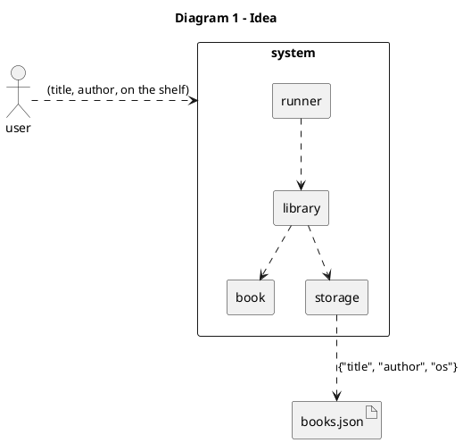
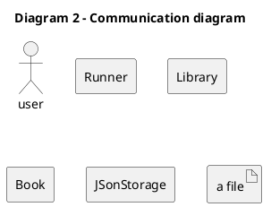
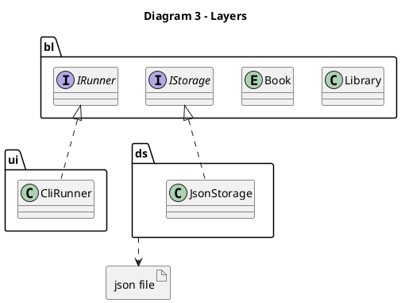
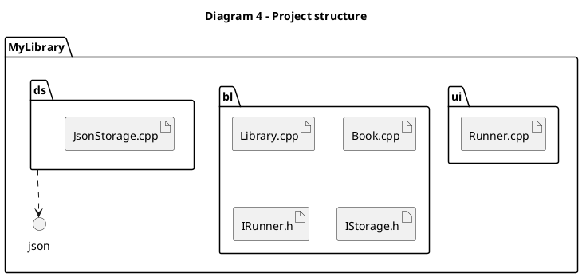
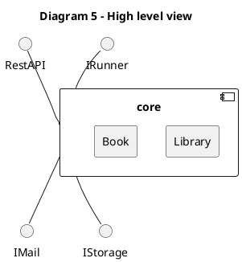

# PlantUML 
* Narzędzie oraz interpreter do ściągnięcia [PlantUML](http://plantuml.com)
* [Interpreter online](https://www.planttext.com)

# Przykłady

Poniżej znajdują się diagramy odręczne oraz odpowiadące im instrukcje w [PlantUML](http://plantuml.com)













# Wtyczka do [SublimeText 3](https://www.sublimetext.com/3)

* [PlantUmlDiagrams](https://packagecontrol.io/packages/PlantUmlDiagrams)

Domyślnie łączy się z serwerem, aby zainterpretować diagram, ale dociągnij interpreter [plantuml.jar](http://plantuml.com/download)

W pliku konfiguracyjnym trzeba dodać :
```js
{
 "jar_file": "[twoja-sciezka]/plantuml.jar"
 }
```

# Przekazywanie UML pomiędzy programistami

Serwis [rextester](https://rextester.com)
* Menu "Run Code"
* Guzik na dole: "Live cooperation"
* Nadaj nazwę nowej tablicy i wyślij link innym deweloperom
* Aby zarządzać tablicami oraz uprawnieniami do nich musisz się zarejestrować
